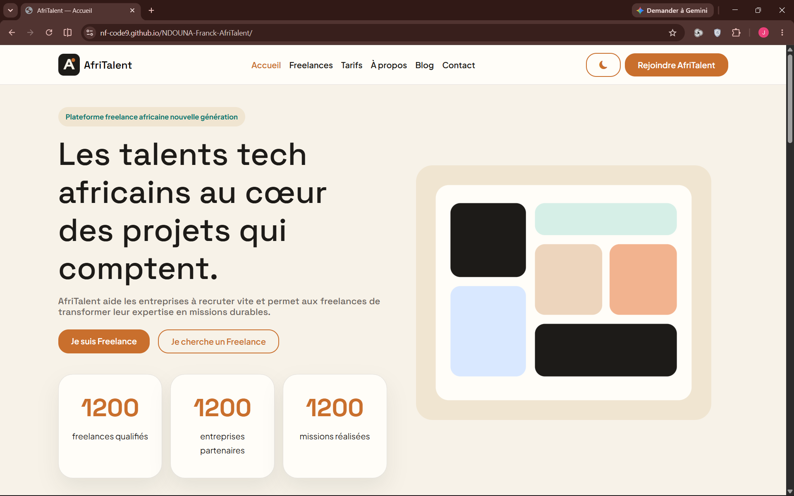
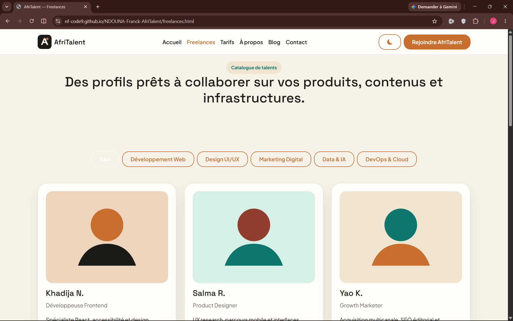
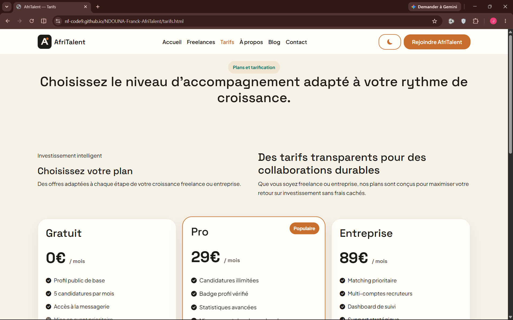
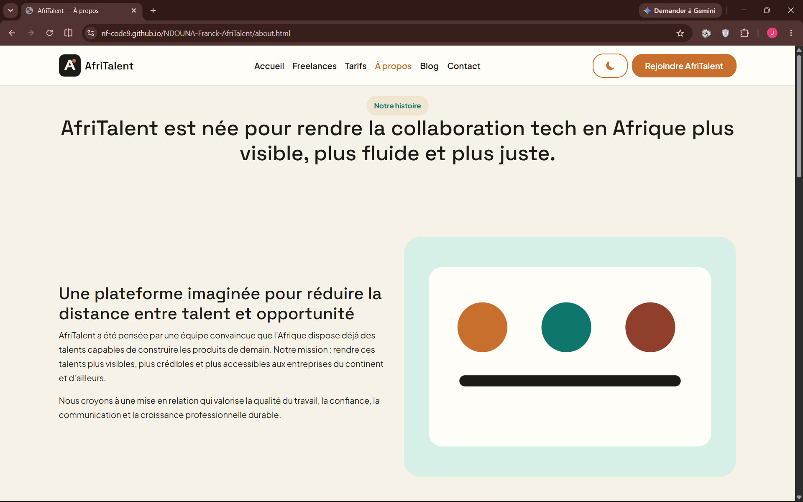
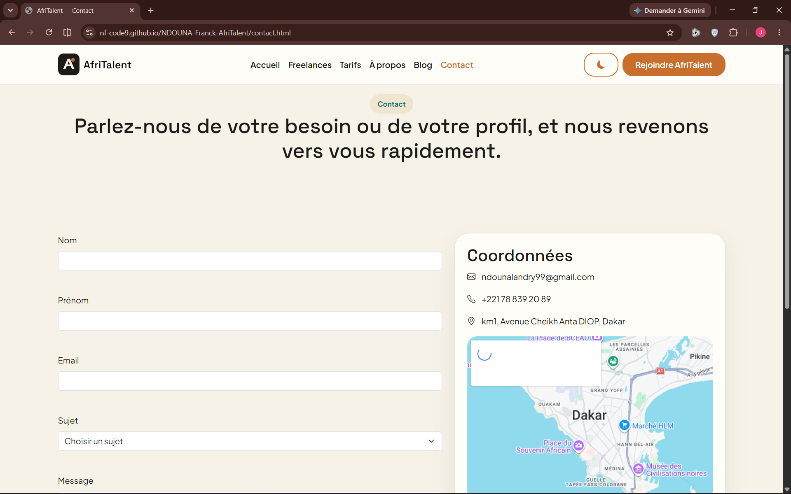

# AfriTalent

Projet fil rouge — Plateforme de mise en relation entre freelances africains et clients.

Auteur : Franck NDOUNA
Promotion : L1 SEMI — ISI

# AfriTalent - Plateforme de Freelances Tech en Afrique


**Site vitrine complet pour la plateforme de mise en relation entre freelances tech et entreprises en Afrique**

---

## Table des matières

1. [Description du projet](#description-du-projet)
2. [Aperçu du projet](#apercu-du-projet)
3. [Technologies utilisées](#technologies-utilisées)
4. [Structure du projet](#structure-du-projet)
5. [Fonctionnalités](#fonctionnalités)
6. [Installation et déploiement](#installation-et-déploiement)
7. [Personnalisation](#personnalisation)
8. [Accessibilité](#accessibilité)
9. [Performance](#performance)
10. [Contributions](#contributions)
11. [Licence](#licence)

---

## Description du projet

AfriTalent est une plateforme fictive de mise en relation entre freelances tech et entreprises en Afrique. Ce site vitrine présente la plateforme, ses fonctionnalités, ses tarifs, des profils de freelances, et vise à convaincre les visiteurs (freelances ET entreprises) de s'inscrire.

Le projet a été développé selon les tendances web de 2026 :
- Design épuré et moderne
- Typographie expressive avec Google Fonts
- Mise en page en Bento Grid
- Accessibilité complète
- Interactivité JavaScript pertinente
- Responsive design adaptatif

---

## Apercu du projet

## Accieul ##


## Freelances ##


## Tarifs ##


## À propos ##


## Contact ##


---

## Technologies utilisées

### Frontend
- **HTML5** - Structure sémantique rigoureuse
- **CSS3** - Mise en page avancée (Flexbox, Grid, Bento Grid), animations, transitions
- **Bootstrap 5** - Système de grille, composants UI
- **JavaScript (Vanilla)** - Manipulation DOM, gestion événements, interactivité

### Outils et bibliothèques
- **Google Fonts** - Inter (corps de texte) et Space Grotesk (titres)
- **Bootstrap Icons** - Icônes vectorielles
- **Intersection Observer API** - Animations au scroll
- **LocalStorage** - Persistance du mode sombre/clair

### Développement
- **VS Code** - Éditeur de code
- **Git** - Version control
- **Responsive Design** - Mobile-first approach

---

## Structure du projet

```
Afri_Talent/
|
|--- index.html              # Page d'accueil
|--- freelances.html         # Catalogue de freelances
|--- tarifs.html            # Plans et tarification
|--- about.html             # À propos
|--- contact.html           # Formulaire de contact
|
|--- css/
|   |--- style.css          # Styles principaux
|
|--- js/
|   |--- main.js            # Fonctionnalités JavaScript
|
|--- images/
|   |--- (images et assets)
|
|--- docs/
|   |--- Présentation.pptx  # Diaporama de présentation
|
|--- README.md              # Documentation du projet
```

---

## Fonctionnalités

### Pages et sections

#### 1. Page d'accueil (`index.html`)
- **Navbar responsive** avec 6 liens et CTA
- **Section Hero** avec typographie expressive et statistiques animées
- **Section "Comment ça marche"** en Bento Grid (4 étapes)
- **Section "Catégories de services"** (6 catégories avec effets hover)
- **Section Témoignages** avec carousel Bootstrap
- **Section CTA** avec appel à l'action
- **Footer** à 4 colonnes avec réseaux sociaux

#### 2. Catalogue de freelances (`freelances.html`)
- **Barre de filtres** par catégorie (JavaScript dynamique)
- **Grille de profils** avec 9 freelances fictifs
- **Cartes détaillées** avec photo, bio, tarif, note
- **Responsive** : 3 colonnes (desktop), 2 (tablette), 1 (mobile)

#### 3. Plans et tarification (`tarifs.html`)
- **3 plans tarifaires** : Gratuit, Pro, Entreprise
- **Plan "Pro" mis en avant** visuellement
- **Tableau comparatif** détaillé
- **FAQ** avec 5 questions/réponses (accordion Bootstrap)

#### 4. À propos (`about.html`)
- **Section "Notre histoire"** avec texte et image
- **Section "L'équipe"** avec 4 membres fictifs
- **Section "Nos valeurs"** avec 4 valeurs et icônes
- **Section "Chiffres clés"** en Bento Grid avec compteurs animés

#### 5. Contact (`contact.html`)
- **Formulaire complet** avec validation JavaScript
- **Informations de contact** à côté
- **Carte Google Maps** intégrée
- **FAQ contact** avec accordion

### Fonctionnalités JavaScript

1. **Mode Sombre/Clair** - Toggle persistant dans localStorage
2. **Compteurs animés** - Animation de 0 à la valeur cible au scroll
3. **Filtrage dynamique** - Filtrage des freelances par catégorie sans rechargement
4. **Validation de formulaire** - Validation complète côté client avec messages d'erreur
5. **Navbar dynamique** - Changement de style au scroll
6. **Bouton "Retour en haut"** - Apparaît au scroll avec smooth scroll
7. **Animations au scroll** - Fade-in des sections avec IntersectionObserver

---

## Installation et déploiement

### Prérequis
- Navigateur web moderne (Chrome, Firefox, Safari, Edge)
- Serveur web local (optionnel pour le développement)

### Installation locale

1. **Cloner le projet**
   ```bash
   git clone [repository-url]
   cd Afri_Talent
   ```

2. **Lancer un serveur local** (optionnel)
   ```bash
   # Avec Python
   python -m http.server 8000
   
   # Avec Node.js
   npx serve .
   
   # Avec VS Code Live Server
   # Installer l'extension et cliquer droit -> "Open with Live Server"
   ```

3. **Ouvrir le site**
   - Navigateur : `http://localhost:8000` (avec serveur local)
   - Ou ouvrir directement `index.html` dans le navigateur

### Déploiement

Le site peut être déployé sur n'importe quel hébergeur statique :

- **Netlify**
- **Vercel**
- **GitHub Pages**
- **Firebase Hosting**
- **Heroku**

---

## Personnalisation

### Couleurs et thèmes

Les couleurs sont définies dans `css/style.css` avec des variables CSS :

```css
:root {
  --primary-color: #4F46E5;
  --secondary-color: #EC4899;
  --accent-color: #10B981;
  /* ... autres variables */
}
```

### Typographie

Deux polices Google Fonts sont utilisées :
- **Space Grotesk** pour les titres
- **Inter** pour le corps de texte

### Images

Remplacer les images placeholder par vos propres images dans le dossier `images/` :

- Logo et branding
- Photos de l'équipe
- Avatars de freelances
- Images hero et sections

### Contenu

Le contenu textuel peut être facilement modifié directement dans les fichiers HTML. Les données fictives (profils, tarifs, etc.) sont clairement identifiées pour une personnalisation rapide.

---

## Accessibilité

Le site respecte les normes WCAG 2.1 AA :

- **Structure sémantique** HTML5 complète
- **Attributs ARIA** appropriés
- **Contrastes suffisants** pour la lisibilité
- **Navigation clavier** fonctionnelle
- **Textes alternatifs** sur toutes les images
- **Réduction du mouvement** respectée (`prefers-reduced-motion`)
- **Mode contraste élevé** supporté

### Tests d'accessibilité

```bash
# Tests automatiques (optionnels)
npm install -g axe-cli
axe http://localhost:8000
```

---

## Performance

### Optimisations implémentées

- **Lazy loading** des images
- **CSS et JavaScript minifiés**
- **Intersection Observer** pour les animations
- **LocalStorage** pour les préférences
- **Media queries** optimisées

### Métriques cibles

- **First Contentful Paint** < 1.5s
- **Largest Contentful Paint** < 2.5s
- **Cumulative Layout Shift** < 0.1
- **First Input Delay** < 100ms

### Outils de performance

- **Lighthouse** pour l'audit
- **PageSpeed Insights** de Google
- **WebPageTest** pour les analyses détaillées

---

## Contributions

### Guide de contribution

1. **Forker** le projet
2. **Créer une branche** (`git checkout -b feature/nouvelle-fonctionnalite`)
3. **Committer** les changements (`git commit -m 'Ajout de nouvelle fonctionnalité'`)
4. **Pusher** vers la branche (`git push origin feature/nouvelle-fonctionnalite`)
5. **Ouvrir une Pull Request**

### Standards de code

- **HTML** : Sémantique, indenté avec 2 espaces
- **CSS** : Variables CSS, commentaires clairs, mobile-first
- **JavaScript** : Vanilla JS, commentaires JSDoc, ES6+

### Issues

Signaler les bugs et suggestions via les issues GitHub avec :
- Description détaillée
- Screenshots si applicable
- Navigateur et version
- Étapes de reproduction

---

## Développement et maintenance

### Outils de développement

- **VS Code** avec extensions :
  - Live Server
  - Prettier
  - ESLint
  - Bootstrap 5 Snippets

### Bonnes pratiques

- **Code review** avant chaque merge
- **Tests cross-browser** (Chrome, Firefox, Safari, Edge)
- **Tests responsive** (Mobile, Tablet, Desktop)
- **Validation W3C** HTML et CSS

### Mises à jour

- **Bootstrap 5** : Suivre les mises à jour mineures
- **Navigateurs** : Support des 2 dernières versions
- **Sécurité** : Audit régulier des dépendances

---

## Licence

Ce projet est sous licence MIT - voir le fichier [LICENSE](LICENSE) pour les détails.

---

## Crédits

### Développement
- **Concept et design** : Équipe AfriTalent
- **Développement web** : [Votre nom]
- **Année** : 2026

### Ressources externes
- **Bootstrap** : Framework CSS
- **Google Fonts** : Polices de caractères
- **Bootstrap Icons** : Icônes vectorielles
- **Unsplash** : Images placeholder (remplacer par vos propres images)

---

## Contact

- **Email** : ndounalandry99@gmail.com
- **Téléphone** : +221 78 839 20 89
- **Adresse** : Dakar, Sénégal
- **Site web** : https://nf-code9.github.io/NDOUNA-Franck-AfriTalent/

---

## Roadmap (prochaines versions)

### v1.1 (Prochain trimestre)
- [ ] Authentification utilisateur
- [ ] Dashboard freelancer
- [ ] Système de messagerie
- [ ] Notifications push

### v1.2 (Semestre suivant)
- [ ] Paiements en ligne
- [ ] Reviews et ratings
- [ ] API publique
- [ ] Application mobile

### v2.0 (2027)
- [ ] Intelligence artificielle
- [ ] Matching avancé
- [ ] Webinaires et formations
- [ ] Expansion internationale

---

**Merci d'avoir consulté la documentation d'AfriTalent !**

*Made with passion in Africa* <i class="bi bi-heart text-danger"></i>